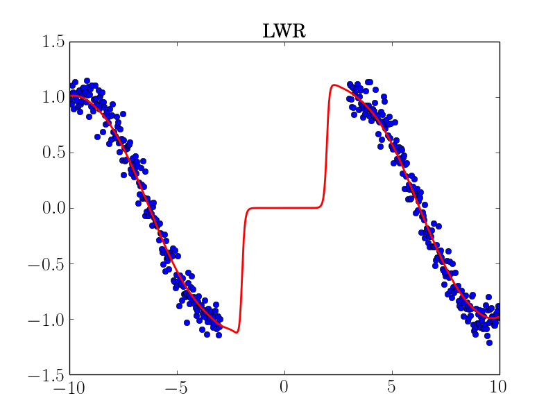
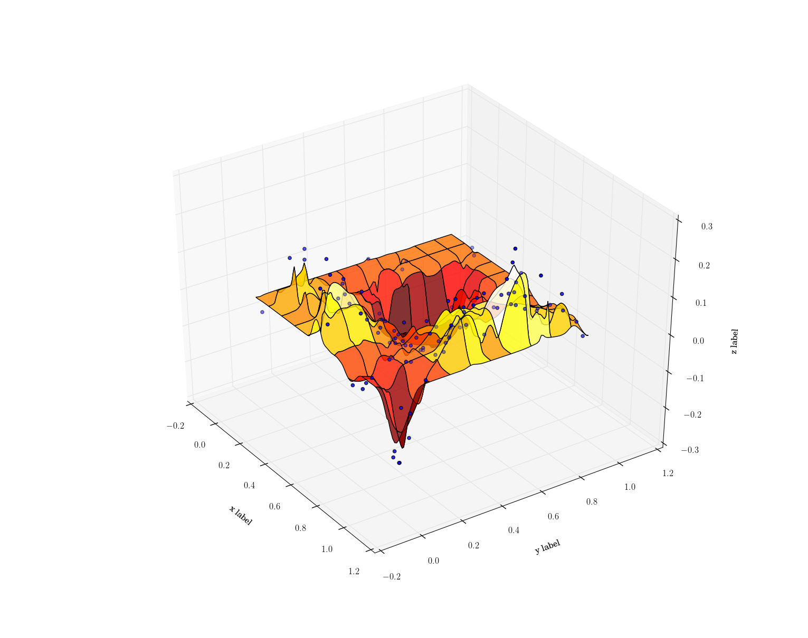
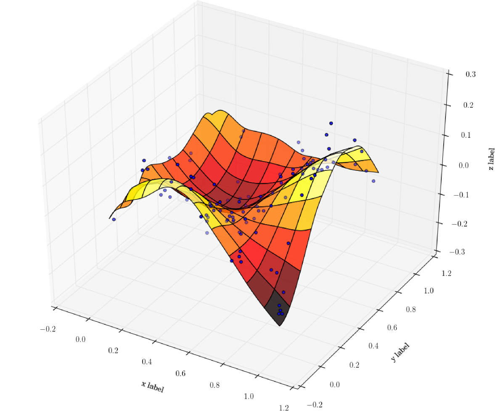

# Non-parametric regression

[](https://travis-ci.org/gpldecha/non-parametric-regression)

This package provides a set of non-parametric methods for regression. The implementation of the methods is done in C++ whilst the interface is python. Non-parametric regression methods typically retains all the training data. The value of a new test point is then a function of the neighbouring points. As a result it is essential to use a fast space partion method, such as 
[**FLANN**](http://www.cs.ubc.ca/research/flann/).  


# Installation

This library is based on  [**Armadillo**](http://arma.sourceforge.net/download.html) which is an intuitive interface
to Eigen. Make sure you have installed all the dependencies to Eigen before proceedind to install armadillo. You 
can simply run the following commnad to install all the dependencies:

```sh
sudo apt-get install libatlas-base-dev libatlas3gf-base libboost-python-dev libflann-dev libarmadillo-dev
```

Checkout the repository:
```sh
$ https://github.com/gpldecha/non-parametric-regression.git
```
cd to the directory in question and build it.
```sh
$ cd non-parametric-regression
$ mkdir build
$ cd build
$ cmake .
$ make
```
install the library and python modules
```sh
$ sudo make install 
```
# Quick start
For a quick example of usage, open your favourit python editor (I use [**Spyder**](https://pythonhosted.org/spyder/)) and run
the examples python code: 

```sh
./non-parametric-regression/examples/example1.py
```

<p align="center">

</p>
For a 3D example, run the following:
```sh
./non-parametric-regression/examples/lwr_example2.py
```
this is what you should get:<br> 
 


# Regression methods

* Locally weighted regression (LWR)

Library of locally weighted (LWR) regression. LWR is a memory based regression which is non-parameteric. 
It stores a set of input, X, and target values, y which form the desired training data for the regressor 
function y = f(X).

When a new data point is queried X*, to be evaluated by the regressor f(X*), the K closest points to X* are found. 
On these points a linear regressor function is fitted and when evaluated at the point X* gives the value y*.
