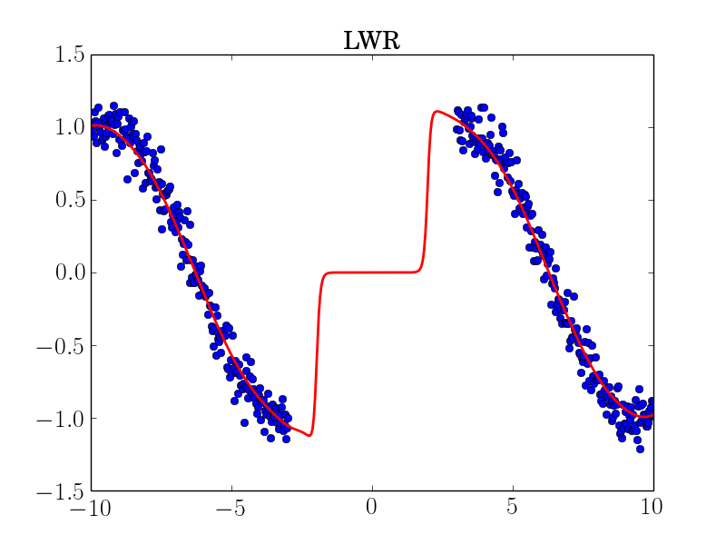
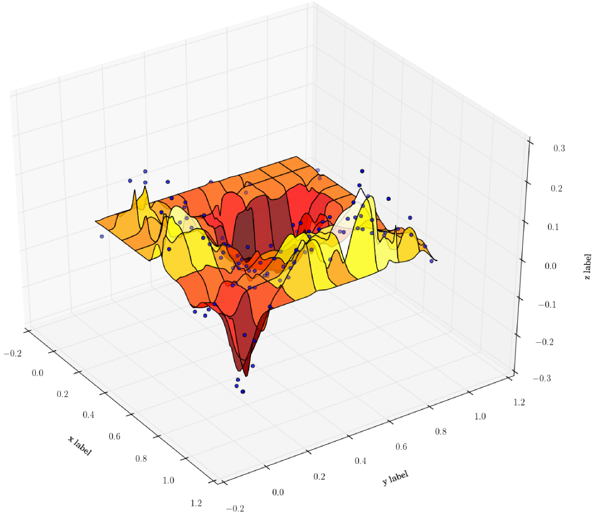
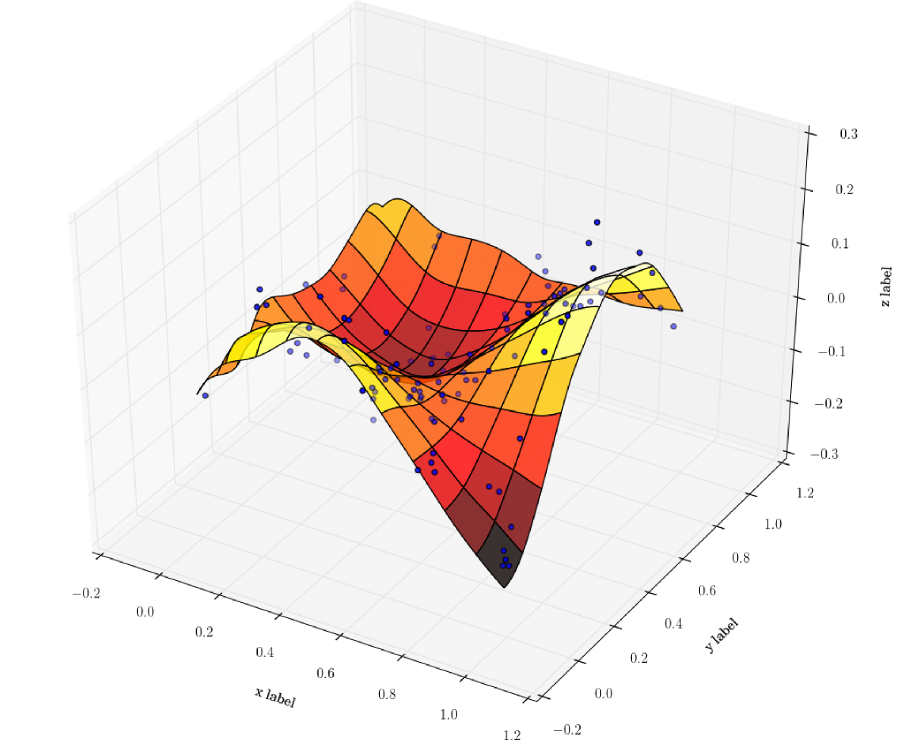

# Python examples

I will be using [**Spyder**](https://pythonhosted.org/spyder/) to run the examples.

## lwr_1D_example1.py

After opening lwr_1D_example1.py you should see the following in the Spyder editor:

<p align="center">
  
</p>

Proceed to run the first code block (**ctrl+enter**) and then the second.
The second code block will plot the 1D regression.


```sh
./non-parametric-regression/examples/example1.py
```
## lwr_1D_example2.py

## lwr_2D_example1.py

## lwr_2D_example2.py


<p align="center">

</p>
For a 3D example, run the following:
```sh
./non-parametric-regression/examples/lwr_example2.py
```
this is what you should get:<br> 
 
